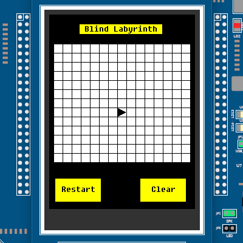
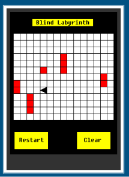
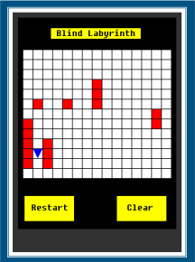
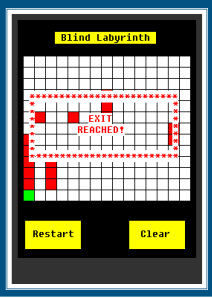

# Blind Labyrinth 
<p align="center">
 
 
</p>

<p align="center">
  
</p>

Extra points projects for the course of "Architetture dei Sistemi di Elaborazione" (Computer Architectures) at Politecnico di Torino.

The project consists in the implementation on an embedded platform of the popular game "blind labyrinth". This version runs on the NXP LandTiger Board equipped with the LPC1768 microcontroller.  

## Brief description

The user drives a robot equipped with a proximity sensor detecting obstacles to the exit.  The robot covers 1 slot per second.

The game is available in two versions:

- **basic version** : the user controls the robot only using buttons KEY1, KEY2 and INT0 to move or rotate the player. The LEDs blink at different frequencies according to current direction and distance from obstacle.

- **advanced version** : the user drives the robot using the joystick. The map is displayed on the touchscreen display. The proximity sensor only displays obstacles in the nearby. Pressing the joystick, the robot switches mode (and color): now it only reveals obstacles in the nearby without moving. Pressing again it goes back to moving mode.

  <div align="center">
       
       
       
  </div>

Take a look at the ```doc``` folder for a complete description of the specifications. 

## How to use
The project was developed on Keil uVision 5 running on a Windows 10 virtual machine. 

To use it, simply clone the repository on your machine 

``` git clone https://github.com/PronElle/Blind-Labyrinth```

and open it with Keil uVision (double click on ```sample.uvprojx``` file).
